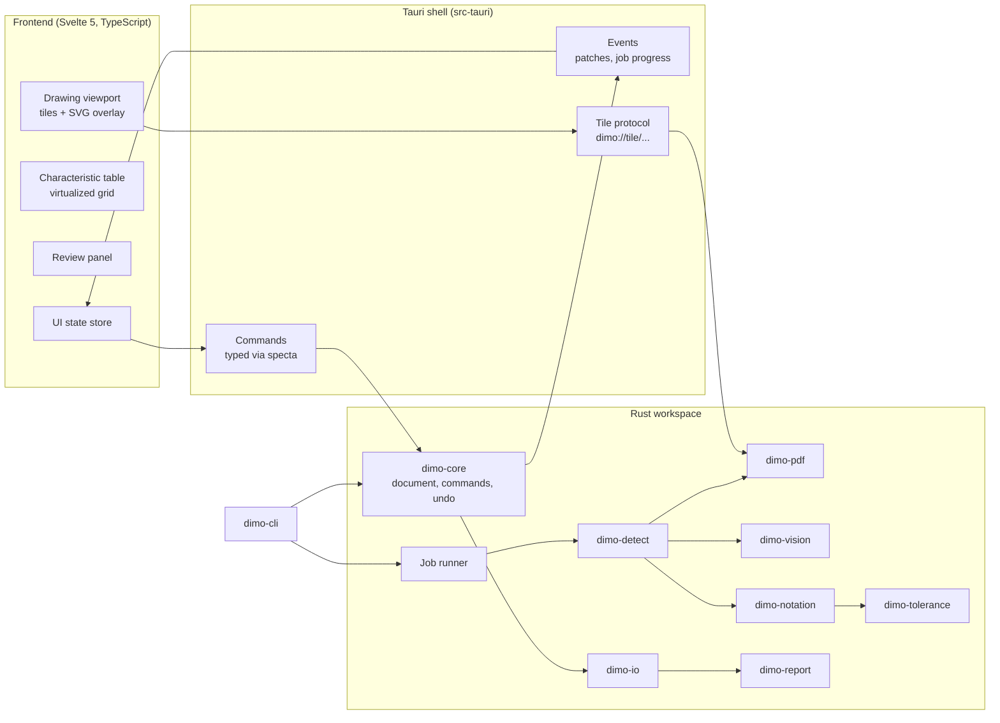

# 05 Architecture

## Overview

Dimo is a Tauri 2 desktop application with a **thick Rust core and a thin web frontend**. All domain logic (characteristics, numbering, tolerances, recognition, export) lives in Rust crates that know nothing about the UI. The same crates power a command line tool. The frontend renders state and sends commands.



## Repository layout

```
dimo/
  crates/
    dimo-core/        domain model, command pattern, undo/redo, numbering, validation. No IO.
    dimo-notation/    grammar for dimension and tolerance callouts, feature control frames
    dimo-tolerance/   tolerance engine, fit tables, general tolerance tables (data driven)
    dimo-pdf/         PDF access: tile rendering, text runs with geometry, vector paths, ballooned PDF writing
    dimo-vision/      image preprocessing, OCR engine trait and backends, symbol classifier
    dimo-detect/      layout analysis, token grouping, characteristic proposals, confidence, balloon placement
    dimo-io/          project container, migrations, imports (CSV, spreadsheet, QIF), exports (CSV, XLSX, QIF)
    dimo-report/      report templating and PDF rendering
    dimo-cli/         headless command line tool
  apps/
    desktop/
      src-tauri/      Tauri shell: commands, events, protocols, permissions, job runner wiring
      src/            Svelte frontend
  data/
    tolerances/       tolerance tables as data files
    templates/        bundled report templates
    models/           model manifests (binaries downloaded at build time, not committed)
  ml/                 training and evaluation scripts for recognition models (Python, not shipped)
  corpus/             test drawings with ground truth and provenance
  docs/
```

All crates use the prefix `dimo-`.

## Core principles

### 1. Rust owns the document

The authoritative project state lives in `dimo-core`. The frontend never mutates domain data directly. It dispatches **commands**:

```rust
enum Command {
    AddCharacteristic { sheet: SheetId, region: Region, fields: CharFields },
    MoveBalloon { id: BalloonId, pos: Point, anchor: Option<Point> },
    UpdateFields { id: CharId, patch: CharFieldsPatch },
    Renumber { strategy: NumberingStrategy, scope: Scope },
    AcceptProposals { ids: Vec<ProposalId> },
    // ...
}
```

`dimo-core` applies the command, pushes its inverse onto the undo stack, appends an audit entry, and returns a **patch** describing what changed. The frontend applies the patch to its view store. Benefits: one source of truth, undo works the same in GUI and CLI, business rules cannot drift into TypeScript.

Interactive gestures (dragging a balloon) are handled optimistically in the frontend and committed as one command on release, so IPC latency never affects feel.

### 2. Automation produces proposals, not data

Recognition jobs run in the background and return `Proposal` objects. Proposals are shown as ghost balloons and rows. They become characteristics only through `AcceptProposals`, which is an undoable command. Auto accept rules (e.g. "accept above 0.99 confidence on vector sheets") are explicit project settings.

### 3. One coordinate system

All geometry is stored in **sheet space**: PDF user space units (1/72 inch), origin top left, per sheet. Raster sheets get a virtual sheet size derived from DPI. Tiles, OCR crops, balloon positions and exports all convert from this one system, so a balloon placed in the viewer lands exactly where OCR saw the text.

### 4. Engines behind traits

```rust
trait TextSource {        // where text comes from
    fn text_runs(&self, sheet: &Sheet, region: Option<Region>) -> Result<Vec<TextRun>>;
}
trait OcrEngine {          // pluggable OCR backends
    fn detect(&self, img: &GrayImage) -> Result<Vec<OrientedBox>>;
    fn recognize(&self, img: &GrayImage, boxes: &[OrientedBox]) -> Result<Vec<Recognized>>;
}
trait SymbolClassifier {   // GD&T and other symbols
    fn classify(&self, crop: &GrayImage) -> Result<Vec<(Symbol, f32)>>;
}
trait Exporter {           // report and data outputs
    fn export(&self, project: &Project, opts: &ExportOptions, out: &mut dyn Write) -> Result<()>;
}
```

New engines (another OCR model, an operating system OCR service, a future plugin) plug in without touching the rest of the system.

## Frontend structure

```
src/
  lib/
    ipc/            generated bindings (tauri-specta), thin wrappers
    stores/         view state: selection, viewport, filters, patches applied from core
    viewport/       tile layer, SVG overlay (balloons, leaders, regions, proposals), tools
    table/          virtualized characteristic grid, inline editing
    review/         review queue, source crop + parsed fields
    measure/        result grid per serial number
    templates/      template preview
    i18n/
  routes/ or views/ project, review, measurement, export, settings
```

The viewport is the most demanding part:

- **Tile layer:** `` or canvas tiles requested through the custom URI protocol `dimo://tile/{doc}/{sheet}/{zoom}/{x}/{y}`. Tiles are rendered in Rust by pdfium on a worker pool and cached in memory (LRU) and on disk.
- **Overlay:** one SVG in sheet space with a single transform for pan and zoom. Balloons, leaders, selection boxes and proposal ghosts are SVG elements. A few hundred to a few thousand elements are well within SVG limits. If profiling shows otherwise, the overlay switches to canvas without changing the data flow.

## IPC

| Mechanism | Used for |
|---|---|
| Tauri commands | All document commands and queries. Types generated with `specta` / `tauri-specta` into TypeScript |
| Tauri events | Patches after commands, job progress, job results, autosave status |
| Custom URI protocol | Tile images, source crops for review. Binary, cacheable, no base64 overhead |
| Channels | Streaming large job results (detection on many sheets) |

## Background jobs

A job runner in `src-tauri` (tokio for orchestration, rayon for CPU bound work) runs rendering, recognition, comparison and export. Every job has an ID, progress events, and a cancellation token. Jobs read an immutable snapshot of the document and return proposals or files, so they never conflict with user edits.

## Persistence

See [07 Data model](07-data-model.md). Project files are ZIP containers with JSON and the embedded original drawings. Autosave writes a journal next to the project and compacts on save.

## Security model

- Tauri capabilities grant the frontend only the commands it needs. No shell, no arbitrary file system access, no HTTP from the webview.
- Network access exists only in Rust behind explicit opt in settings and the organization policy file.
- Report templates render in a sandbox without file system or network access.

## Command line tool

`dimo-cli` links the same crates:

```
dimo detect drawing.pdf --profile customer-a.toml --out project.dimo
dimo export project.dimo --template fai-forms --out report.xlsx
dimo export project.dimo --format json
```

This enables batch use and integration into automation tools without the GUI.
