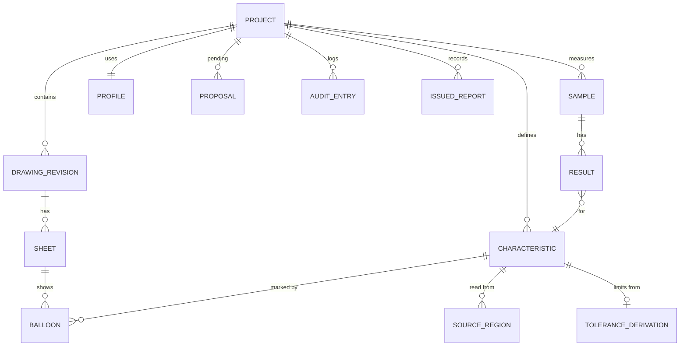

# 07 Data model

## Entities



### Project
Part number, part name, customer, order or purchase reference, current drawing revision, numbering lock state, settings, profile reference.

### DrawingRevision
Revision label, imported file name, SHA-256 hash, import date, sheets. Old revisions stay in the project for comparison and traceability.

### Sheet
Index, size in sheet units, rotation, kind (`vector_text`, `vector_outlined`, `raster`), raster DPI if applicable, zone grid definition, detected views and title block region, unit and scale.

### Characteristic
| Field | Notes |
|---|---|
| `id` | Stable UUID, never changes |
| `number` | Display number, e.g. `12`, `12.1`, `12A` |
| `kind` | linear, diameter, radius, angle, chamfer, thread, surface_texture, geometric, note, flag_note, ... |
| `requirement_text` | Text as it appears on the drawing, normalized |
| `nominal`, `unit` | Decimal stored exactly (`rust_decimal`), never as float |
| `upper_dev`, `lower_dev`, `upper_limit`, `lower_limit` | Limits always stored explicitly, deviations kept for display |
| `fit` | e.g. `H7`, if present |
| `geometric` | For frames: symbol, tolerance, zone shape, modifiers, datum references (primary, secondary, tertiary with modifiers), segments |
| `quantity` | From `4X`, `2 PL` etc. |
| `classification` | critical, major, minor, key, none |
| `inspection` | method, gauge, sampling, frequency |
| `inspect` | bool, false for reference and basic dimensions by default |
| `parent` | For composite characteristics |
| `flag_note` | Link to flag note characteristic if flagged |
| `status` | proposed, accepted, verified, rejected |
| `origin` | manual, box_select, auto_detect, carried_over |
| `confidence` | Per field and overall, for automated origins |
| `comment` | Free text |

### SourceRegion
Sheet, oriented bounding box (center, size, angle), text source (`pdf_text`, `ocr:<engine>@<model version>`), raw recognized text. Allows reproducing exactly what the machine saw.

### ToleranceDerivation
Which rule produced the limits: `explicit`, `fit(ISO 286, H7)`, `general(ISO 2768, m, linear, range 30..120)`, `decimal_rule(X.XX)`, `custom_table(<name>)`, plus the human readable explanation shown in the UI.

### Balloon
Characteristic ID, sheet, position, leader anchor, style override, sub-index for multi-instance numbering.

### Sample and Result
A sample is a measured part (serial number, date, inspector, gauge list). A result holds a measured value or attribute (OK / not OK), the evaluation, and the source (manual, import file plus row).

### Proposal
Output of recognition before acceptance. Same shape as characteristic fields plus job ID and engine versions.

### AuditEntry
Timestamp, user name (local OS user or configured name), command, before and after. Used for history and traceability.

### IssuedReport
Template ID and version, drawing revision hash, export time, output file hash. Locks numbering when the first report is issued (configurable).

## Project file format

Project file extension: `.dimo`.

A ZIP container:

```
project.dimo
  manifest.json          format name, schema version, app version, created/modified
  project.json           project, characteristics, balloons, samples, results, settings
  audit.jsonl            append only audit log
  drawings/
    <sha256>.pdf         original files, byte identical to import
  profile.toml           snapshot of the profile used (customer settings)
  templates/             snapshots of templates used for issued reports (optional)
```

Rules:

- Caches (tiles, OCR intermediates) are **never** stored in the project. They live in the user cache directory, keyed by file hash.
- `schema_version` is an integer. Every increase ships a migration and a test fixture.
- A JSON Schema is generated from the Rust types (`schemars`) and published in `docs/schema/`, so other tools can read projects.
- A "folder mode" stores the same structure unzipped, useful for version control and debugging.

## Profiles and data files

Profiles are TOML files that bundle customer specific behavior:

```toml
[profile]
name = "Customer A, aerospace"

[numbering]
strategy = "sheet_zone"
multi_instance = "sub_number"   # or "quantity"
lock_on_issue = true
insert_when_locked = "sub_number"

[balloon]
shape = "circle"
size_mm = 6.0
color = "#0050ff"
leader = true

[tolerance]
default_general = "ISO 2768-mK"
decimal_rules = [ { places = 1, tol = "0.1" }, { places = 2, tol = "0.05" } ]

[classification]
critical_markers = ["CC", "▼"]

[export]
templates = ["fai-forms", "check-sheet"]
```

Tolerance tables are data files in `data/tolerances/` with source references, a verification status (`draft` or `verified`, see D-43) and a test vector file each. Users can add custom tables in the same format.
