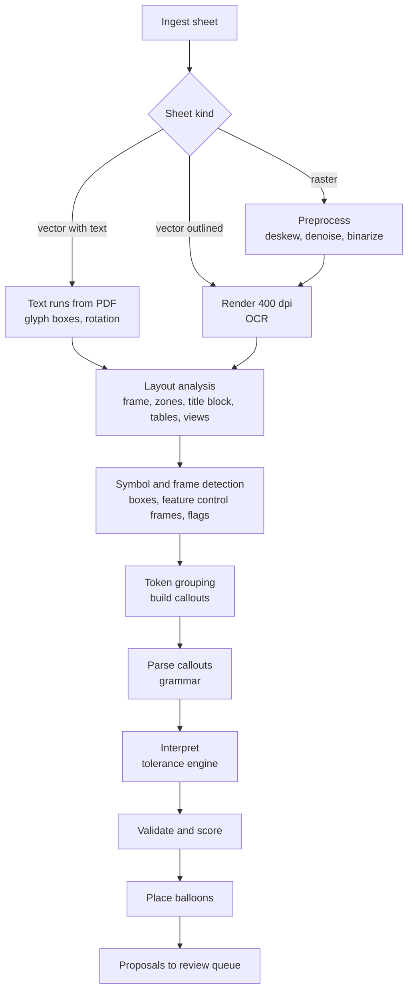

# 08 Recognition pipeline

Goal: turn a drawing sheet into a list of characteristic proposals with limits, confidence and source regions, as fast and as honestly as possible.



## Stage 1: Ingest and classify

Hash the file, enumerate sheets, and classify each sheet:

- **vector_text:** PDF text objects cover the dimension text. Cheapest and most accurate path.
- **vector_outlined:** Text was exported as curves (common in CAD exports). Detected when the sheet has many small closed paths and little or no text. Rendered and OCRed.
- **raster:** Scanned or image only. Preprocessed and OCRed.

Mixed sheets are handled per region: use text runs where they exist, OCR the rest.

Classification inspects the content stream itself (text operators, fonts, ToUnicode maps) and never relies on a single library's text extraction result. The corpus contains a sheet where one common library reports zero characters although all text is present.

## Stage 2: Text acquisition

- **PDF text:** pdfium returns characters with boxes and rotation. Characters are merged into runs by baseline and spacing. Font names help recognize symbol fonts (GD&T fonts map private code points to symbols, mapping tables are data files).
- **OCR:** text detection model returns oriented boxes, so rotated dimension text (90 degrees, aligned to dimension lines) works without rotating the whole sheet. The recognition model reads each box. Known OCR confusions, confirmed on the corpus: the diameter symbol is read as `0` or `O`, zero as letter `O`, callouts are split or merged. The grammar repairs these (a leading `0`/`O` directly followed by a size and a fit or tolerance is a diameter), see `corpus/notes/`. A drawing specific character set (digits, `±`, `⌀`, `°`, `×`, `+`, `-`, `.`, `,`, letters for fits and threads) constrains decoding.
- **Preprocessing (raster only):** deskew from frame lines, adaptive binarization, small speckle removal, line removal under text where text touches dimension lines.

## Stage 3: Layout analysis

- **Frame and zones:** detect the border and the zone labels (letters and numbers on the frame) to compute zone for every position.
- **Title block:** detect the table like region in the lower right (configurable). Parse fields: general tolerance, units, projection symbol, revision, part number, material, surface default. The title block feeds the tolerance engine and is excluded from dimension detection, except for requirements that must be inspected.
- **Tables:** revision table, variable dimension tables, hole tables. Parsed as tables, not as loose text.
- **Views:** cluster geometry into views to support per view numbering.

## Stage 4: Symbols and frames

- **Feature control frames:** rectangles subdivided into cells, found from vector paths or from line detection on rasters. Each cell is classified: symbol cell (classifier), tolerance cell (OCR plus symbol prefix like `⌀` and modifiers like Ⓜ Ⓛ), datum cells (letters plus modifiers).
- **Basic dimensions:** text inside a single tight rectangle.
- **Flag notes:** flag or triangle shapes with a number inside. Linked to the matching note in the notes list.
- **Datum feature symbols, surface texture symbols, weld symbols:** symbol classifier on candidate shapes.

The symbol classifier is a small CNN trained on **synthetic data**: symbols rendered from free fonts and own vector drawings with random scale, rotation, line weight, noise and blur. This keeps training data fully owned.

## Stage 5: Token grouping

Recognized tokens near each other are combined into one callout using geometry (alignment to the same dimension line, distance, font size) and grammar expectations:

```
⌀  12  H7          → diameter, fit
25  +0.1 / -0.05   → stacked tolerance, upper above lower
4X ⌀6.6 THRU       → quantity, diameter, suffix
M8x1.25-6H         → thread
(42)               → reference
R5, SR10, 1x45°    → radius, spherical radius, chamfer
Ra 1.6             → surface texture
```

## Stage 6: Parsing

`dimo-notation` implements the callout grammar with winnow. It handles decimal comma and point, hyphen and Unicode minus (U+2212), inch fractions, unicode and ASCII variants (`⌀`, `Ø`, `DIA`), and returns either a structured callout or a parse error with the position, which lowers confidence instead of failing silently. Property tests generate valid callouts, print them, and parse them back.

## Stage 7: Interpretation

`dimo-tolerance` applies the precedence from FR-TOL-01:

1. Explicit tolerance on the callout.
2. Fit designation expanded with ISO 286 tables.
3. Drawing specific rules (variable table, local notes).
4. General tolerance standard from the title block by size range.
5. Decimal place rule from the title block.

Explicit deviations on the drawing always win over table values. If they differ from the table for the stated fit (CAD tools sometimes use inch based fit tables and print converted values), Dimo shows an info hint and never corrects the value. If a dimension has no tolerance and the drawing declares no general tolerance, the characteristic is flagged for review as "no tolerance defined" instead of receiving a default.

Each result records its derivation and explanation, e.g. *"No tolerance on drawing. ISO 2768-m applies. Nominal 45 mm is in range over 30 up to 120 mm, so ±0.3 mm."*

## Stage 8: Validation and confidence

Confidence combines:

- recognition probabilities of the tokens,
- parse completeness (all expected parts found),
- semantic checks (lower limit below upper, fit exists in the table, thread pitch valid for diameter, angle within 0 to 360),
- plausibility (nominal consistent with drawing scale and neighboring dimensions, optional),
- source kind (PDF text is trusted more than OCR).

Confidence is **calibrated** on the corpus so that thresholds mean what they say (NFR-REC-04).

## Stage 9: Balloon placement

Greedy placement on a free space map: candidate positions around the callout, scored by distance, overlap with geometry, text and other balloons, and leader crossing. Users can re-run placement for a selection.

## Stage 10: Review

Proposals go to the review queue (lowest confidence first). The coverage view shows any drawing text not linked to a characteristic or explicitly ignored, which directly targets the "missed note on the last sheet" problem.

## Evaluation

- `corpus/` holds drawings with a ground truth file (`*.truth.json`: characteristics with regions and expected limits).
- Drawings come from contributors and from a **synthetic drawing generator** (own tool that produces dimensioned drawings with known truth, in vector and degraded raster form).
- CI computes recall, precision, field accuracy and calibration per sheet kind and fails on regression.
- Every model in `data/models/` has a model card: architecture, training data, metrics, license.
